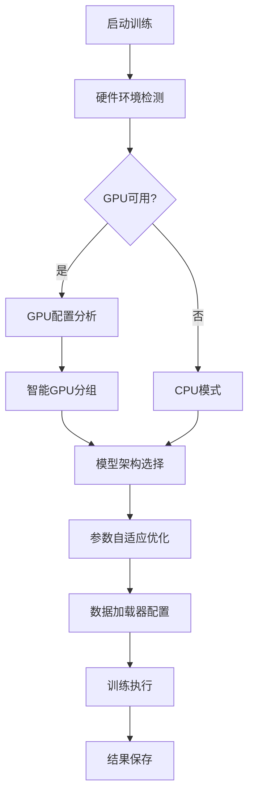

# CIFAR-10 图像分类智能优化训练框架

## 📋 项目概述

本项目是一个**CIFAR-10图像分类训练框架**，集成了**智能硬件检测、自适应模型选择、多GPU优化调度**等核心功能。项目的设计理念是让深度学习训练变得**更简单、更智能、更高效**。最佳准确率: 0.9451。

### 🎯 核心特性

- **🧠 智能硬件检测**: 自动识别GPU配置，包括型号、数量、显存容量
- **⚡ 动态模型选择**: 根据硬件能力自动选择最适合的模型架构
- **🚀 多GPU智能调度**: 自动组合同型号GPU，避免混合使用导致的性能瓶颈
- **📊 参数自适应优化**: 智能推荐批次大小、学习率、数据加载参数
- **🛠️ 稳定性增强**: 针对常见问题提供了多重保护机制
- **📈 实时监控**: 训练过程中显示详细的性能指标和硬件状态

### 🏗️ 项目架构

```
第六部分/
├── train.py              # 主训练脚本 (核心入口)
├── models.py             # 模型定义 (SmallCifarNet & PowerCifarNet)
├── requirements.txt      # Python依赖包
├── test.sh              # 自动化测试脚本
├── README.md            # 项目文档
├── data/                # 数据集目录
│   └── cifar-10-batches-py/
└── runs/                # 训练输出目录
    └── cifar10_optimized/
        ├── best_model.pth         # 最佳模型权重
        ├── training_history.json  # 训练历史数据
        └── training_curves.png    # 可视化训练曲线
```

## 🔄 智能训练流程

当您运行 `python train.py` 时，框架会自动执行以下10步优化流程：



### 📋 详细流程说明

#### 步骤1-2: 启动与硬件检测

```python
# 自动检测硬件配置
hw_config = auto_detect_hardware()
```

- 🔍 检测CUDA环境是否可用
- 📊 统计GPU数量、型号和显存容量
- 💾 计算总显存和单卡显存
- ⚡ 评估硬件算力等级

#### 步骤3-4: GPU智能分组

```python
# 智能选择同型号GPU组合
gpu_names = [torch.cuda.get_device_name(i) for i in range(num_gpus)]
most_common_gpu = Counter(gpu_names).most_common(1)[0][0]
device_ids = [i for i, name in enumerate(gpu_names) if name == most_common_gpu]
```

- 🎯  自动识别并选择数量最多的同型号GPU
- 🚀 避免混合GPU导致的性能瓶颈（如A6000+3090混合）
- 🎮 确保参与训练的GPU性能完全一致

#### 步骤5: 动态模型选择

```python
# 根据硬件能力选择最适合的模型
if hw_config['num_gpus'] >= 3 and hw_config['total_memory_gb'] >= 60:
    model = PowerCifarNet(num_classes=10, width_mult=2.5)  # 大模型
elif hw_config['num_gpus'] >= 2 or hw_config['total_memory_gb'] >= 40:
    model = PowerCifarNet(num_classes=10, width_mult=1.5)  # 中模型
else:
    model = SmallCifarNet(num_classes=10)  # 轻量模型
```

- 🧠 **SmallCifarNet**: ~1.2M参数，适合单GPU或低显存环境
- ⚡ **PowerCifarNet**: 2-10M+参数，深度更深、表达能力更强

#### 步骤6-7: 参数自适应优化

```python
# 智能推荐训练参数
if total_memory_gb >= 60:
    recommended_batch_size = 512
    recommended_workers = 16
elif total_memory_gb >= 40:
    recommended_batch_size = 384
    recommended_workers = 12
# ...
```

- 📊 根据GPU显存智能推荐批次大小
- 🔄 自动调整数据加载器进程数
- 📈 学习率自动缩放（与批次大小成比例）

#### 步骤8-10: 训练执行与结果保存

- 🏃 启动训练循环，实时监控性能指标
- 💾 自动保存最佳模型权重和训练历史
- 📊 生成训练曲线可视化图表

## 🚀 快速开始指南

1.**安装Python依赖**

```bash
# 建议先创建虚拟环境
# 安装依赖包
pip install -r requirements.txt
```

 2.**验证PyTorch安装**

```bash
python -c "import torch; print(f'PyTorch版本: {torch.__version__}'); print(f'CUDA可用: {torch.cuda.is_available()}')"
```

### 🧪 环境验证（推荐）

运行自动化测试脚本，验证环境配置正确性：

```bash
# Linux/Mac
bash test.sh

# Windows (使用Git Bash或WSL)
bash test.sh
# 或者直接运行Python命令
python train.py --epochs 2 --out-dir runs/test
```

**测试脚本功能**:

- ✅ 检查Python版本兼容性
- ✅ 验证依赖包完整性
- ✅ 测试GPU环境配置
- ✅ 运行2轮快速训练验证
- ✅ 确保数据下载和加载正常

### 🏁 启动训练

#### 🎯 智能优化模式（推荐）

```bash
python train.py
```

**特点**:

- 🧠 自动检测硬件配置
- ⚡ 智能选择模型和参数
- 📊 实时显示训练进度
- 💾 自动保存最佳模型

#### 🎛️ 自定义参数模式

```bash
# 长时间训练
python train.py --epochs 100

# 指定输出目录
python train.py --out-dir runs/my_experiment

# 手动指定批次大小
python train.py --batch-size 256 --num-workers 8

# 禁用自动优化，完全手动控制
python train.py --disable-auto --batch-size 128 --lr 0.01
```

#### 📋 常用命令参数

| 参数               | 默认值                 | 说明           |
| ------------------ | ---------------------- | -------------- |
| `--epochs`       | 50                     | 训练轮数       |
| `--batch-size`   | 自动                   | 批次大小       |
| `--lr`           | 0.1                    | 初始学习率     |
| `--num-workers`  | 自动                   | 数据加载进程数 |
| `--out-dir`      | runs/cifar10_optimized | 输出目录       |
| `--data-dir`     | data                   | 数据集目录     |
| `--disable-auto` | False                  | 禁用智能优化   |
| `--weight-decay` | 1e-4                   | L2正则化系数   |

### 📊 训练输出解读

训练开始后，您会看到如下输出格式：

```
--- [1/10] 训练启动 ---
[硬件检测] GPU数量: 2
[硬件检测] GPU 0: NVIDIA GeForce RTX 3090 (24.0GB)
[硬件检测] GPU 1: NVIDIA GeForce RTX 3090 (24.0GB)
[硬件检测] 总显存: 48.0GB
[硬件检测] 推荐批次大小: 384
[硬件检测] 推荐worker数: 12
[GPU优化] 自动选择组合: NVIDIA GeForce RTX 3090 (共 2 张)
--- [4/10] 主设备变更为 cuda:0, 模型已移至该GPU ---
--- [5/10] DataParallel 模型包装完成, 使用设备: [0, 1] ---
[模型选择] 使用PowerCifarNet (中等模型)
--- [6/10] 模型参数量: 4,234,826 ---

Epoch [1/50] | Batch [100/391] | Loss: 1.234 | Acc: 45.67% | LR: 0.0950 | GPU Mem: 8.2GB
```

### 🎯 训练成功标志

训练正常进行时，您应该看到：

- ✅ GPU内存占用稳定（不会持续增长）
- ✅ 损失值逐步下降
- ✅ 准确率逐步提升（通常30轮后能达到85%+）
- ✅ 学习率按计划调整
- ✅ 无CUDA错误或内存溢出

## 🏗️ 核心设计理念与技术架构

### 🎯 设计哲学：让AI训练变得智能

本项目的核心设计理念是**"智能自适应"**，即让深度学习训练系统能够：

- 🧠 **自主思考**: 自动分析硬件环境，无需人工配置
- ⚡ **动态适应**: 根据实际条件选择最优策略
- 🛠️ **稳健运行**: 面对复杂环境时保持稳定性
- 📈 **性能最优**: 在任何硬件配置下都能发挥最佳性能

### 🚀 技术

#### 1. GPU调度算法

**核心问题**: 混合GPU环境下的性能瓶颈

```python
# 传统方案的问题
device_ids = [0, 1, 2]  # 包含A6000(cuda:0) + 3090(cuda:1,2)
# 结果：性能被最慢的GPU限制，出现严重不平衡
```

**方案**:

```python
def intelligent_gpu_grouping(gpu_names):
    """智能GPU分组算法"""
    # 1. 统计各型号GPU数量
    gpu_counts = Counter(gpu_names)
  
    # 2. 选择数量最多的同型号GPU
    most_common_gpu = gpu_counts.most_common(1)[0][0]
    device_ids = [i for i, name in enumerate(gpu_names) if name == most_common_gpu]
  
    # 3. 设置主设备为该组的第一个GPU
    master_device = f"cuda:{device_ids[0]}"
  
    return device_ids, master_device
```

**技术优势**:

- ✅ 消除混合GPU性能瓶颈
- ✅ 保证训练同步性
- ✅ 最大化硬件利用率
- ✅ 避免CUDA通信失败

#### 2. 自适应模型架构设计

**设计理念**: 让模型规模匹配硬件能力

##### SmallCifarNet (轻量级架构)

```python
# 参数量: ~1.2M
# 适用场景: 单GPU、低显存、快速验证
Architecture:
Input(3,32,32) 
→ Conv2d(32) + BN + ReLU + MaxPool 
→ Conv2d(64) + BN + ReLU + MaxPool 
→ Conv2d(128) + BN + ReLU + MaxPool 
→ FC(512) → FC(10)
```

##### PowerCifarNet (高性能架构)

```python
# 参数量: 2M-10M+ (可调节)
# 适用场景: 多GPU、大显存、高精度需求
Architecture:
Input(3,32,32) 
→ [Conv2d + Conv2d + BN + ReLU + MaxPool + Dropout2d] × 4组
→ AdaptiveAvgPool2d 
→ [FC + Dropout] × 3层 → FC(10)

# width_mult参数控制模型大小
base_channels = int(64 * width_mult)
```

**智能选择策略**:

```python
def select_optimal_model(num_gpus, total_memory_gb):
    if num_gpus >= 3 and total_memory_gb >= 60:
        return PowerCifarNet(width_mult=2.5)  # 大型配置
    elif num_gpus >= 2 or total_memory_gb >= 40:
        return PowerCifarNet(width_mult=1.5)  # 中型配置  
    else:
        return SmallCifarNet()  # 轻量配置
```

#### 3. 参数自适应优化系统

**批次大小智能推荐**:

```python
def recommend_batch_size(total_memory_gb, num_gpus):
    """基于显存和GPU数量的批次大小推荐算法"""
    if total_memory_gb >= 60:    # 3x RTX 3090 级别
        return 512
    elif total_memory_gb >= 40:  # 2x RTX 3080 级别  
        return 384
    elif total_memory_gb >= 20:  # 1x RTX 3080 级别
        return 256
    else:                        # 入门级GPU
        return 128
```

**学习率动态缩放**:

```python
# 遵循线性缩放规则
scaled_lr = base_lr * sqrt(batch_size / base_batch_size)
# 确保大批次训练的稳定性
```

#### 4. 数据加载优化策略

**高性能数据管道**:

```python
DataLoader(
    dataset, 
    batch_size=batch_size,
    num_workers=auto_workers,        # 自动计算最优进程数
    pin_memory=True,                 # GPU直接内存访问
    persistent_workers=True,         # 保持worker进程活跃
    prefetch_factor=4,               # 预取4个批次
)
```

#### 5. 稳定性保障机制

**混合精度训练**:

```python
# 自动启用AMP，提高训练速度和显存利用率
with torch.cuda.amp.autocast():
    output = model(input)
    loss = criterion(output, target)
```

**环境变量优化**:

```python
# 解决多GPU通信问题
os.environ['NCCL_P2P_DISABLE'] = '1'   # 禁用P2P通信
os.environ['NCCL_IB_DISABLE'] = '1'     # 禁用InfiniBand
```

**内存管理**:

```python
# 优化CUDA内存分配
os.environ['PYTORCH_CUDA_ALLOC_CONF'] = 'max_split_size_mb:128'
torch.backends.cudnn.benchmark = True   # 优化卷积算法选择
```

### 🎨 数据增强策略

**平衡增强方案**（避免过度正则化）:

```python
train_transform = transforms.Compose([
    transforms.RandomCrop(32, padding=4),      # 随机裁剪
    transforms.RandomHorizontalFlip(),         # 水平翻转
    transforms.ToTensor(),       
    transforms.Normalize([0.4914, 0.4822, 0.4465], 
                        [0.2023, 0.1994, 0.2010]),  # CIFAR-10标准化
    transforms.RandomErasing(p=0.25, scale=(0.02, 0.2)),  # 轻度随机擦除
])
```

**设计原则**:

- ✅ 保证模型能学到核心特征
- ✅ 避免过度增强导致的收敛困难
- ✅ 平衡泛化能力与训练稳定性

## 🛠️ 问题诊断与解决方案

### 📊 问题分类与解决策略

#### 🚨 类别1：GPU兼容性问题

##### 问题1: 混合GPU导致启动卡顿或程序挂死

**现象描述**:

```bash
--- [1/10] 训练启动 ---
[硬件检测] GPU数量: 3
[硬件检测] GPU 0: NVIDIA RTX A6000 (48.0GB)
[硬件检测] GPU 1: NVIDIA GeForce RTX 3090 (24.0GB)  
[硬件检测] GPU 2: NVIDIA GeForce RTX 3090 (24.0GB)
# 程序在此处卡住，无任何输出，GPU利用率为0%
```

**深度原因分析**:

```python
# 问题的技术根源
1. P2P通信失败:
   - A6000 (Ampere架构) vs RTX 3090 (Ampere架构)
   - 不同的PCIe拓扑结构导致P2P通信初始化超时
   - NCCL默认尝试使用高速通信，但混合环境下可能不兼容

2. 内存拓扑不匹配:
   - A6000: 48GB显存，不同的内存控制器
   - RTX 3090: 24GB显存
   - DataParallel假设所有设备内存结构相同

3. 主设备调度错误:
   - 默认使用cuda:0(A6000)作为参数服务器
   - 但实际计算分配给cuda:1,2(RTX 3090)
   - 跨架构的数据传输产生严重瓶颈
```

**解决方案**:

```python
# 1. 环境变量优化 (必须在导入torch之前设置)
os.environ['NCCL_P2P_DISABLE'] = '1'      # 禁用P2P直连
os.environ['NCCL_IB_DISABLE'] = '1'       # 禁用InfiniBand
os.environ['CUDA_LAUNCH_BLOCKING'] = '1'   # 同步CUDA调用(debug用)

# 2. 智能GPU分组算法
def resolve_mixed_gpu_issue():
    gpu_names = [torch.cuda.get_device_name(i) for i in range(torch.cuda.device_count())]
    gpu_counts = Counter(gpu_names)
  
    # 自动选择数量最多的同种GPU
    most_common_gpu = gpu_counts.most_common(1)[0][0]
    device_ids = [i for i, name in enumerate(gpu_names) if name == most_common_gpu]
  
    print(f"[GPU优化] 选中: {most_common_gpu} × {len(device_ids)}")
    print(f"[GPU优化] 忽略: {set(range(len(gpu_names))) - set(device_ids)}")
  
    return device_ids

# 3. 正确的主设备设置
device_ids = resolve_mixed_gpu_issue()
main_device = torch.device(f"cuda:{device_ids[0]}")
model.to(main_device)  # 先移动模型到主设备
model = nn.DataParallel(model, device_ids=device_ids)
```

#### 🔥 类别2：训练稳定性问题

##### 问题2: 训练曲线剧烈震荡，收敛困难

**现象描述**:

```
Epoch [5/50] | Loss: 1.456 | Acc: 45.2%
Epoch [6/50] | Loss: 1.623 | Acc: 38.9%  # 准确率下降
Epoch [7/50] | Loss: 1.334 | Acc: 51.3%  # 又上升
Epoch [8/50] | Loss: 1.789 | Acc: 33.1%  # 再次下降
```

**深度原因分析**:

```python
# 早期版本的过度优化问题
problems = {
    "数据增强过强": [
        "RandomRotation(degrees=30)",        # 旋转过大
        "ColorJitter(0.8, 0.8, 0.8, 0.2)",  # 颜色扭曲过强
        "RandomErasing(p=0.7)",              # 擦除概率过高
        "同时使用多种强增强"                    # 叠加效应
    ],
    "学习率调度激进": [
        "OneCycleLR(max_lr=0.5)",            # 最大学习率过高
        "快速衰减到极小值",                    # 衰减过快
        "没有warm-up阶段"                    # 缺少预热
    ],
    "批次大小不匹配": [
        "大批次 + 高学习率",                  # 组合不当
        "没有考虑GPU显存限制",                # 超出硬件能力
    ]
}
```

**优化后的稳定方案**:

```python
# 1. 平衡的数据增强
train_transform = transforms.Compose([
    transforms.RandomCrop(32, padding=4),        # 适度裁剪
    transforms.RandomHorizontalFlip(p=0.5),      # 50%翻转概率
    transforms.ToTensor(),
    transforms.Normalize(mean=[0.4914, 0.4822, 0.4465],
                        std=[0.2023, 0.1994, 0.2010]),
    transforms.RandomErasing(p=0.25, scale=(0.02, 0.2))  # 降低擦除强度
])

# 2. 稳定的学习率调度
def get_stable_scheduler(optimizer, epochs, batch_size):
    if batch_size >= 256:
        # 大批次使用余弦退火
        return torch.optim.lr_scheduler.CosineAnnealingLR(optimizer, T_max=epochs)
    else:
        # 小批次使用阶梯衰减
        return torch.optim.lr_scheduler.MultiStepLR(optimizer, milestones=[30, 45], gamma=0.1)

# 3. 自适应学习率缩放
base_lr = 0.1
scaled_lr = base_lr * math.sqrt(batch_size / 128)  # 平方根缩放更稳定
```

## 🚀 参数调优

### ⚡ 性能优化技巧

#### 1. 批次大小优化策略

```python
def find_optimal_batch_size(model, device, start_size=32):
    """动态寻找最优批次大小"""
    batch_size = start_size
    max_batch_size = 2048
  
    print(f"[优化] 开始寻找最优批次大小...")
  
    while batch_size <= max_batch_size:
        try:
            # 模拟训练负载
            dummy_input = torch.randn(batch_size, 3, 32, 32).to(device)
            dummy_target = torch.randint(0, 10, (batch_size,)).to(device)
  
            # 清空缓存
            torch.cuda.empty_cache()
  
            # 测试前向+反向传播
            with torch.cuda.amp.autocast():
                output = model(dummy_input)
                loss = F.cross_entropy(output, dummy_target)
                loss.backward()
  
            # 记录成功的批次大小
            successful_batch_size = batch_size
            print(f"[优化] ✅ 批次大小 {batch_size} 可行")
  
            # 尝试更大的批次
            batch_size *= 2
  
        except RuntimeError as e:
            if "out of memory" in str(e):
                print(f"[优化] 📊 最优批次大小: {successful_batch_size}")
                return successful_batch_size
            else:
                raise e
  
    return successful_batch_size

# 使用方法
optimal_batch_size = find_optimal_batch_size(model, device)
```

#### 2. 学习率调度优化

```python
def create_advanced_scheduler(optimizer, total_epochs, batch_size):
    """创建高级学习率调度器"""
  
    if batch_size >= 256:
        # 大批次：使用带重启的余弦退火
        scheduler = torch.optim.lr_scheduler.CosineAnnealingWarmRestarts(
            optimizer, 
            T_0=10,      # 第一次重启周期
            T_mult=2,    # 每次重启周期翻倍
            eta_min=1e-6 # 最小学习率
        )
        print("[调度器] 使用CosineAnnealingWarmRestarts (大批次优化)")
  
    elif batch_size >= 128:
        # 中等批次：标准余弦退火
        scheduler = torch.optim.lr_scheduler.CosineAnnealingLR(
            optimizer, 
            T_max=total_epochs,
            eta_min=1e-6
        )
        print("[调度器] 使用CosineAnnealingLR (中等批次)")
  
    else:
        # 小批次：多步衰减
        scheduler = torch.optim.lr_scheduler.MultiStepLR(
            optimizer,
            milestones=[int(0.6 * total_epochs), int(0.8 * total_epochs)],
            gamma=0.1
        )
        print("[调度器] 使用MultiStepLR (小批次)")
  
    return scheduler
```

#### 3. 混合精度训练优化

```python
class AdvancedMixedPrecisionTrainer:
    """高级混合精度训练器"""
  
    def __init__(self, model, optimizer):
        self.model = model
        self.optimizer = optimizer
        self.scaler = torch.cuda.amp.GradScaler(
            init_scale=2**16,     # 初始缩放因子
            growth_factor=2.0,    # 缩放因子增长率
            backoff_factor=0.5,   # 缩放因子回退率
            growth_interval=2000  # 增长检查间隔
        )
  
    def train_step(self, inputs, targets):
        self.optimizer.zero_grad()
  
        # 前向传播 (自动混合精度)
        with torch.cuda.amp.autocast():
            outputs = self.model(inputs)
            loss = F.cross_entropy(outputs, targets)
  
        # 反向传播 (缩放梯度)
        self.scaler.scale(loss).backward()
  
        # 梯度裁剪 (防止梯度爆炸)
        self.scaler.unscale_(self.optimizer)
        torch.nn.utils.clip_grad_norm_(self.model.parameters(), max_norm=1.0)
  
        # 优化器步进
        self.scaler.step(self.optimizer)
        self.scaler.update()
  
        return loss.item()
```

#### 4. 数据加载优化

```python
class UltraFastDataLoader:
    """超高性能数据加载器"""
  
    def __init__(self, dataset, batch_size, num_workers=None):
        if num_workers is None:
            # 智能计算最优worker数量
            num_workers = min(batch_size // 32, os.cpu_count(), 16)
  
        self.dataloader = DataLoader(
            dataset,
            batch_size=batch_size,
            shuffle=True,
            num_workers=num_workers,
            pin_memory=True,              # GPU内存锁定
            persistent_workers=True,      # 保持worker进程
            prefetch_factor=8,            # 增加预取缓冲
            drop_last=True,              # 保持批次一致
            generator=torch.Generator().manual_seed(42)  # 可重现随机性
        )
  
        print(f"[数据加载器] Worker数量: {num_workers}, 预取因子: 8")
  
    def __iter__(self):
        return iter(self.dataloader)
  
    def __len__(self):
        return len(self.dataloader)
```

### 🔧 超参数调优指南

#### 自动超参数搜索

```python
def hyperparameter_search(model_class, search_space, num_trials=20):
    """自动超参数搜索"""
    import random
  
    best_accuracy = 0
    best_params = None
    results = []
  
    for trial in range(num_trials):
        # 随机采样超参数
        params = {
            'lr': random.uniform(*search_space['lr']),
            'batch_size': random.choice(search_space['batch_size']),
            'weight_decay': random.uniform(*search_space['weight_decay']),
            'dropout': random.uniform(*search_space['dropout'])
        }
  
        print(f"\n[搜索] Trial {trial+1}/{num_trials}")
        print(f"[搜索] 参数: {params}")
  
        # 快速训练 (少量轮数)
        model = model_class(dropout=params['dropout'])
        accuracy = quick_train(model, params, epochs=10)
  
        results.append((params, accuracy))
  
        if accuracy > best_accuracy:
            best_accuracy = accuracy
            best_params = params
            print(f"[搜索] 🎉 新的最佳准确率: {accuracy:.2%}")
  
    return best_params, results

# 搜索空间定义
search_space = {
    'lr': [0.01, 0.3],
    'batch_size': [64, 128, 256, 512],
    'weight_decay': [1e-5, 1e-3],
    'dropout': [0.3, 0.7]
}

# 执行搜索
best_params, all_results = hyperparameter_search(PowerCifarNet, search_space)
```

### 🎯 不同场景的优化策略

#### 场景1：快速验证 (5分钟内完成)

```bash
python train.py --epochs 10 --batch-size 512 --lr 0.2 --out-dir runs/quick_test
```

```python
# 快速验证配置
quick_config = {
    "model": "SmallCifarNet",
    "epochs": 10,
    "batch_size": 512,
    "lr": 0.2,
    "data_augmentation": "minimal",
    "target_accuracy": 75
}
```

#### 场景2：高精度训练 (追求最佳性能)

```bash
python train.py --epochs 200 --batch-size 256 --lr 0.05 --weight-decay 5e-4
```

```python
# 高精度配置
high_accuracy_config = {
    "model": "PowerCifarNet",
    "width_mult": 2.0,
    "epochs": 200,
    "batch_size": 256,
    "lr": 0.05,
    "scheduler": "CosineAnnealingWarmRestarts",
    "data_augmentation": "heavy",
    "label_smoothing": 0.1,
    "target_accuracy": 96
}
```
